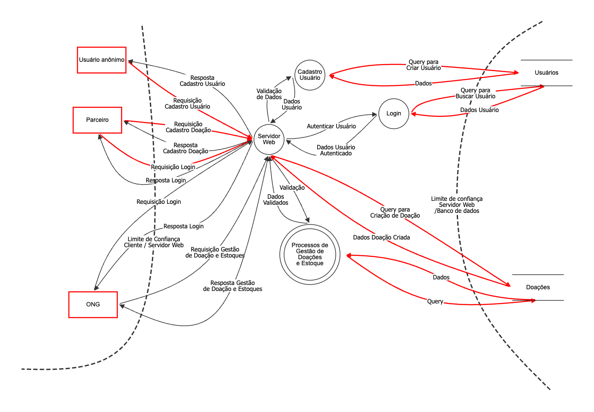

# Caderno de Modelagem de Ameaças

O presente documento se propõe a documentar os passos do processo de criação do Modelo de Ameaças, seguindo a metodologia disponibilizada no site da [OWASP](https://owasp.org/www-community/Threat_Modeling_Process#introduction) 

## 1. Escopo de trabalho

- **Nome da Aplicação**: Portal Comida que Abraça
- **Versão da Aplicação**: 1.3
- **Descrição**: Plataforma para gerenciamento de doações entre a ONG Comida que Abraça e parceiros, permitindo cadastro de doações, solicitações, campanhas e geração de relatórios.
- **Dono do Documento**: Milena Lara Reis Ferreira
- **Participantes**: Érica Alves, Joana Morais, Júlia Vidal Vianna, Mariana Almeida Henriques, Milena Lara Reis Ferreira, Sthel Felipe Torres
- **Revisor**: Érica Alves

### 1.1. Dependências Externas

São entidades externas ao código que podem representar uma ameaça à aplicação, como o ambiente de produção e os requisitos ténicos.

| ID    | Descrição  |
|-------|------------|
| 1 | O front-end React.js será hospedado em um bucket de armazenamento público com HTTPS (ex: AWS S3 + CloudFront ou Azure Blob Static Website). |
| 2 | O servidor back-end em Spring Boot será hospedado em uma instância de serviço de nuvem (como EC2 da AWS ou App Service da Azure) e seguirá as práticas de hardening da plataforma escolhida (patches atualizados, firewalls, controle de acesso). |
| 3 | O banco de dados PostgreSQL será hospedado em um serviço gerenciado (como Amazon RDS ou Azure Database for PostgreSQL) com autenticação reforçada e acesso restrito à rede privada. |
| 4 | Toda comunicação entre front-end, back-end e banco será feita via HTTPS/TLS. O tráfego interno entre back-end e banco de dados ocorrerá em rede privada. |
| 5 | O login e autenticação utilizarão JWT e controle de sessão com expiração, protegendo contra ataques de session hijacking. |  

### 1.2. Níveis de confiança

| ID | Nome                              | Descrição                                                                |
|----|-----------------------------------|--------------------------------------------------------------------------|
| 1  | Visitante Anônimo                 | Usuário que acessou o website mas não forneceu credenciais de login      |
| 2  | Usuário com credenciais válidas   | Usuário que se conectou ao website com suas credenciais de login e senha |
| 3  | Usuário com credenciais inválidas | Usuário que se concetou ao website e está tentando fazer login com credenciais inválidas |
| 4  | Parceiro                          | Usuário cadastrado como parceiro da ONG (doadores, empresas, outras ONGs), consegue cadastrar propostas de doação |
| 5  | Colaborador da ONG                | Usuário cadastrado colaborador da ONG, consegue gerenciar propostas de doações, campanhas e estoque e gerar relatórios |

### 1.3. Pontos de Entrada

São as interfaces através das quais atacantes em potencial podem interagir com a aplicação ou fornecer dados. Essas interfaces podem possuir camadas. 

| ID    | Nome              | Descrição | Níveis de confiança |
|-------|-------------------|-----------|---------------------|
| 1     | Porta HTTPS       | Toda a aplicação será acessada via HTTPS. A API REST e o front-end utilizam este canal.| (1) Visitante Anônimo (2) Usuário Autenticado |
| 1.1   | Página Principal  | Página pública inicial da aplicação com opções de login e informações sobre a ONG.| (1) Visitante Anônimo (2) Usuário Autenticado |
| 1.2   | Página de Login   | Interface para que todos os tipos de usuários possam se autenticar. | (1) Visitante Anônimo (2) Usuário com credenciais válidas (3) Usuário com credenciais inválidas |
| 1.2.1 | Função de Login (Back-end) | Função REST que recebe email e senha, valida as credenciais no banco de dados e retorna um token JWT. | (2) Usuário com credenciais válidas (3) Usuário com credenciais inválidas |
| 1.3   | Página de Cadastro de Parceiro | Formulário para novos parceiros (usuários) se registrarem como doadores, ONGs ou empresas parceiras.| (1) Visitante Anônimo |
| 1.4   | Envio de formulário para doação | Formulário para cadastro de novas doações por parceiros, doadores anônimos ou pela própria ONG (no caso de receberem doações por fora do site) | (1) Visitante Anônimo (2) Usuário Autenticado |
| 1.5   | Acompanhamento de doações registradas | O parceiro da ONG pode visualizar as doações que ele registrou, bem como o status da doação e o beneficiário que recebeu a doação | (4) Parceiro autenticado | 
| 1.6   | Gerenciamento de entrada de doações | A ONG pode aceitar ou rejeitar doações cadastradas por parceiros | (5) Colaborador da ONG autenticado | 
| 1.7   | Gerenciamento de saída de doações | A ONG pode realizar o fluxo de entrega das doações registradas, alterando o status da doação e atribuindo-a ao beneficiário que irá recebê-la. | (5) Colaborador da ONG autenticado | 
| 1.8   | Geração de relatórios | A ONG pode gerar relatórios mensais, trimestrais e anuais sobre a quantidade de itens recebidos, alimentos salvos e os principais doadores. |

### 1.4. Ativos (Assets)

São os elementos em que os atacantes podem ter interesse.

| ID  | Nome                           | Descrição                                                                                       | Níveis de Confiança (Trust Levels)                                                               |
| --- | ------------------------------ | ----------------------------------------------------------------------------------------------- | ------------------------------------------------------------------------------------------------ |
| 1   | Usuários do Sistema            | Ativos relacionados a parceiros, solicitantes, voluntários e administradores da plataforma.     |                                                                                                  |
| 1.1 | Dados de Login dos Usuários    | Credenciais (e-mail e senha) utilizadas para acessar a aplicação.                               | (2) Usuário autenticado (acesso somente aos próprios dados)  (4) Administrador (5) Processo do servidor Web (8) DB Read User |
| 1.2 | Dados Pessoais dos Usuários    | Nome, e-mail, telefone, endereço e CNPJ/CPF, dependendo do tipo de usuário.                     | (4) Administrador (5) Processo do servidor Web (8) DB Read User (9) DB Read/Write User  |
| 1.3 | Histórico de Ações             | Registro de doações feitas, recebidas, canceladas ou pendentes, com timestamps e autores.       | (4) Administrador (6) Administrador do site (9) DB Read/Write User                         |
| 2   | Sistema                        | Ativos relacionados à infraestrutura da aplicação.                                              |                                                                                                  |
| 2.1 | Disponibilidade do Sistema     | A aplicação deve estar disponível 24/7 para permitir cadastros, doações e consultas.            | (5) Administrador do Banco de Dados (6) Administrador do site                                 |
| 2.2 | Execução de Código no Servidor | Capacidade de executar código do back-end (Spring Boot) com permissões do processo do servidor. | (6) Administrador do site (7) Processo do servidor Web                                        |
| 2.3 | Execução de SQL como Read User | Execução de queries de leitura para consultar dados da aplicação e dos usuários.                | (5) Administrador do Banco (8) DB Read User (9) DB Read/Write User                         |
| 2.4 | Execução de SQL como R/W User  | Capacidade de executar queries de leitura, inserção, atualização e remoção no banco de dados.   | (5) Administrador do Banco (9) DB Read/Write User                                             |
| 3   | Website e Sessão Web           | Ativos relacionados à interface web e à sessão de usuário.                                      |                                                                                                  |
| 3.1 | Sessão de Login                | Sessão ativa após autenticação, com tokens ou cookies de sessão.                                | (2) Usuário autenticado (4) Administrador                                                     |
| 3.2 | Acesso ao Servidor de Banco    | Permissão para conectar-se ao banco de dados PostgreSQL usado pela aplicação.                   | (5) Administrador do Banco de Dados                                                              |
| 3.3 | Criação de Novos Usuários      | Permissão para cadastrar novos usuários no sistema, como novos parceiros ou administradores.    | (4) Administrador (6) Administrador do site                                                   |
| 3.4 | Acesso a Logs e Auditorias     | Permissão para visualizar eventos sensíveis como login, alterações em doações e configurações.  | (6) Administrador do site                                                                        |

### 1.5. Diagramas de fluxo de dados

## 2. Determinar as ameaças

## Passo 3: Determinar medidas mitigantes

## Passo 4: Avaliar o trabalho

